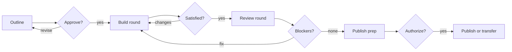

Design, build, review, and publish GitHub Skills-style exercises with custom agents and Agent Skills for learner journeys, workflow-backed validation, and release readiness.

## Installation

### Copilot CLI

Install directly from this repository:

```shell
copilot plugin install arilivigni/gh-skills-builder
```

> [!WARNING]
> Copilot CLI currently supports direct repository installs but marks them as deprecated. Keep this path as a fallback until this plugin is indexed in a marketplace, then prefer `plugin@marketplace` installs.

Or from within an interactive Copilot session:

```
/plugin install arilivigni/gh-skills-builder
```

> [!NOTE]
> Installing from `arilivigni/gh-skills-builder` performs a direct repository install. You can verify the install with:
> ```shell
> copilot plugin list
> ```
> After install, manage the plugin by name (`gh-skills-builder`) for update and uninstall commands.

To update to the latest version:

```shell
copilot plugin update gh-skills-builder
```

To remove the plugin:

```shell
copilot plugin uninstall gh-skills-builder
```

### Copilot App

1. Open the Copilot App and go to **Plugins**.
2. Select **Add plugin**, then provide `arilivigni/gh-skills-builder`.
3. Confirm install, then enable the plugin for your chat/session.

> [!TIP]
> If you prefer VS Code, open the Command Palette (`⌘⇧P` / `Ctrl+Shift+P`), run **Chat: Plugins**, then install **gh-skills-builder** from the plugin picker.

## What's Included

### Agents

| Agent | Mention | Role | Tool Access |
| --- | --- | --- | --- |
| **Orchestrator** | `@github-skills-orchestrator` | Runs the full lifecycle as an approval-gated loop, checking in with you after every build round and every review round. | Full coding and test tools |
| **Outline Architect** | `@github-skills-outline-architect` | Converts an idea, workshop, or demo into a learner-centered exercise outline with objectives, scenario, steps, validation, and success criteria. | Read, search, fetch, and edit planning docs |
| **Exercise Builder** | `@github-skills-exercise-builder` | Converts an approved outline into repository structure, Markdown steps, issue flow, workflows, and validation scaffolding. | Full coding and test tools |
| **Quality Reviewer** | `@github-skills-quality-reviewer` | Reviews an exercise for learning value, validation reliability, workflow safety, accessibility, and publish readiness. | Read, search, run commands, and run tests |
| **Publisher** | `@github-skills-publisher` | Prepares release notes, PR descriptions, validation evidence, final checklist, and publication or org transfer guidance. | Read, edit docs, run commands, and run tests |

### Skills

The plugin provides five lifecycle skills:

- `/orchestrate-github-skills-exercise` — run the whole loop with approval gates between every round.
- `/create-github-skills-outline` — design a new exercise or convert training material into a self-paced GitHub Skills outline.
- `/bootstrap-github-skills-exercise` — create repository files, step Markdown, workflow plans, validation scripts, and starter structure from an approved outline.
- `/review-github-skills-exercise` — audit an exercise for learner experience, validation correctness, workflow safety, accessibility, and readiness.
- `/publish-github-skills-exercise` — prepare final checklist, release notes, PR copy, validation evidence, and publish or transfer guidance.

### Template contract reference

`skills/bootstrap-github-skills-exercise/references/exercise-template-contract.md` captures the concrete
conventions implemented by [`skills/exercise-template`](https://github.com/skills/exercise-template) and
[`skills/exercise-toolkit`](https://github.com/skills/exercise-toolkit): canonical file names, workflow
skeletons, reusable workflow inputs and outputs, action pins, workflow enable/disable chaining, permission
matrix, grading job shape, and the README, step, and review Markdown skeletons. The bootstrap skill and the
Exercise Builder agent read it before writing files.

## Quick Start

### Orchestrated (recommended)

```
@github-skills-orchestrator I want to build a GitHub Skills exercise that teaches [topic].
Use /orchestrate-github-skills-exercise and check in with me after every build and review round.
```

The orchestrator runs the four phases and stops at each gate:



### Phase by phase

#### 1. Create the exercise outline

```
@github-skills-outline-architect I want to teach [topic] as a 30-minute GitHub Skills exercise.
Use /create-github-skills-outline to define objectives, learner steps, and validation ideas.
```

#### 2. Bootstrap the repository

```
@github-skills-exercise-builder Use the approved outline to scaffold the exercise.
Use /bootstrap-github-skills-exercise to create README content, steps, workflows, and validation guidance.
```

#### 3. Review before launch

```
@github-skills-quality-reviewer Review this exercise for learner clarity, validation reliability, workflow safety, and accessibility.
Use /review-github-skills-exercise and prioritize release blockers.
```

#### 4. Prepare for publication

```
@github-skills-publisher Prepare this exercise for release.
Use /publish-github-skills-exercise to produce validation evidence, PR description, release notes, and remaining risks.
```

To publish into an organization or move an existing exercise between organizations:

```
@github-skills-publisher Transfer this exercise from source-org to dest-org and fix the Copy Exercise badge afterward.
```

## How It Works

The plugin splits exercise creation into four focused phases so the human can approve the learning design before repository automation is generated:

- **Outline first** — define the learner outcome, scenario, steps, and validation signals. Every step needs a Theory block and at least one Activity block.
- **Bootstrap second** — create or update repository assets only after the outline is approved.
- **Review third** — catch weak validation, unsafe workflow behavior, unclear learner instructions, missing Theory or Activity blocks, and accessibility issues.
- **Publish last** — assemble release evidence and handoff notes for contribution, rollout, or org transfer.

The Orchestrator agent runs these phases as a loop with four gates and **stops for a user check-in after every
build round and every review round**, so work is never chained build → review → build without review.

## Exercise conventions

Exercises generated by this plugin follow the `skills/exercise-template` contract:

- `.github/steps/N-step.md` ↔ `.github/workflows/N-step.yml` ↔ workflow `name: Step N`, with the final
  workflow as `N-last-step.yml` and review content in `.github/steps/x-review.md`.
- Only `Step 0` is enabled on a fresh copy; each step enables the next as the learner progresses.
- Every step has one `📖 Theory` block with real content and at least one `⌨️ Activity` block.
- Copilot prompts and terminal commands inside an activity use badge-led blockquotes:

  > 

  > 

  > 

## Companion Instructions

The Awesome Copilot plugin spec declares plugin content with `agents`, `commands`, and `skills`. Copilot instructions are standalone resources, so this plugin includes `instructions/github-skills-exercises.instructions.md` as an optional companion file to copy into exercise repositories.

## Evaluation

Test prompts are in `evals/evals.json`. They cover outline creation, bootstrap planning, quality review, publish readiness, orchestrated loop handling, and org-to-org transfer.

## Release process (SemVer)

This plugin follows strict semantic versioning:

| Change type | Version bump | Examples |
| --- | --- | --- |
| Breaking behavior or contract changes | **MAJOR** (`X.0.0`) | Renaming/removing expected capabilities or changing required usage patterns |
| New non-breaking capabilities | **MINOR** (`X.Y.0`) | Adding agents, skills, or non-breaking plugin features |
| Fixes and non-breaking maintenance | **PATCH** (`X.Y.Z`) | Bug fixes, docs updates, wording improvements |

### CI gate

`.github/workflows/plugin-ci.yml` runs on pull requests and pushes to `main` and validates:
- `.github/plugin/plugin.json` syntax
- referenced agent and skill paths from the plugin manifest
- required `name` and `description` metadata presence in each skill `SKILL.md`
- local markdown links in `README.md`
- content consistency via `scripts/validate-content.py`

### Content validation

`scripts/validate-content.py` guards the conventions this plugin teaches. Run it locally:

```shell
python3 -m pip install pyyaml
python3 scripts/validate-content.py          # offline checks
python3 scripts/validate-content.py --online # also verify the pinned toolkit tag resolves
```

It checks that:

| Check | Catches |
| --- | --- |
| Agent frontmatter | Missing `name`/`description`, names that are not lowercase kebab-case, or names that disagree with the filename. The manifest only references `./agents` as a directory, so nothing else validates these. |
| Skill registration | A skill with a `SKILL.md` that was never added to `plugin.json`. |
| Code fence balance | An unclosed fence that silently swallows the rest of a document. |
| YAML blocks | A workflow skeleton that does not parse. These get copy-pasted into real exercises. |
| Toolkit ref consistency | Mixed `skills/exercise-toolkit` refs, for example bumping nine of ten pins. |
| Contract self-consistency | The contract's own step skeleton losing its Theory or Activity block, which would contradict the rule it imposes. |
| Badge canonicalization | Restyled or recolored prompt/terminal badges. |
| Pinned tag resolves (`--online`) | Pinning a draft release, whose git tag does not exist and which breaks every generated workflow. |

### Deployment plan

1. Merge to `main` only after CI is green.
2. Bump `.github/plugin/plugin.json` to the intended release version **before** releasing, and confirm it:

   ```shell
   python3 -m json.tool .github/plugin/plugin.json >/dev/null
   grep '"version"' .github/plugin/plugin.json
   ```

3. Validate install paths (use direct repo install as fallback until marketplace listing is available):

   ```shell
   copilot plugin install arilivigni/gh-skills-builder
   copilot plugin list
   ```

4. Release from `main` by dispatching the `Release` workflow. It tags and publishes for you:

   ```shell
   gh workflow run Release --ref main -f version=X.Y.Z
   ```

   Leave `version` blank to use the manifest value. The workflow refuses to run from any ref other than
   `main`, rejects a version that does not match `plugin.json`, then creates the annotated tag and the
   release with generated notes.

5. Verify the published release and that its tag resolves to the intended commit:

   ```shell
   gh release view vX.Y.Z --json tagName,isDraft,targetCommitish
   gh api repos/arilivigni/gh-skills-builder/git/ref/tags/vX.Y.Z --jq .ref
   ```

> [!IMPORTANT]
> Do not tag by hand. `git tag vX.Y.Z && git push` bypasses the workflow's version check, which is how
> `v1.0.3` shipped while `plugin.json` still read `1.0.2`. Releasing through the workflow makes that
> mismatch impossible.

> [!WARNING]
> Do not use the workflow's `draft` input for a normal release. A draft release has no git tag, so anything
> pinning `@vX.Y.Z` fails to resolve.
