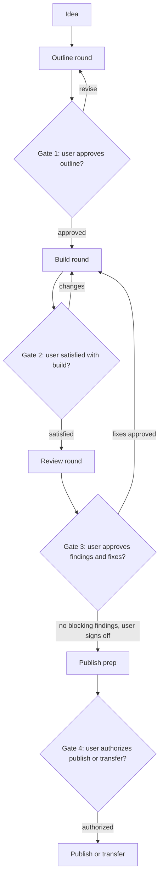

# Orchestrate a GitHub Skills exercise

Use this skill to coordinate the full exercise lifecycle across the four specialist phases. This skill owns
sequencing and the human gates. It does not replace the phase skills; it calls them.

## Phase map

| Phase | Skill | Agent |
| --- | --- | --- |
| 1. Outline | `create-github-skills-outline` | `@github-skills-outline-architect` |
| 2. Bootstrap | `bootstrap-github-skills-exercise` | `@github-skills-exercise-builder` |
| 3. Review and fix | `review-github-skills-exercise` | `@github-skills-quality-reviewer` |
| 4. Publish | `publish-github-skills-exercise` | `@github-skills-publisher` |

## The loop



## Gate rules

These are not optional.

1. **Never skip a gate.** Each gate requires an explicit user response before the next phase starts.
2. **Check in after every round, not just every phase.** After each build round and after each review round,
   stop and report before doing anything else.
3. **Never chain build → review → build without a user check-in between rounds.**
4. **Never auto-publish.** Publishing and transferring always need explicit authorization naming the target
   owner and repository.
5. **Always re-review after a fix round.** Fixes are not trusted until the reviewer has seen them again.
6. **Escalate repeat findings.** If the same finding survives two fix rounds, stop fixing and ask the user to
   decide.
7. **State position in every handoff.** Open each report with the phase and round number, for example
   `Phase 3 — review round 2`.

## Phase 1: Outline

Run `create-github-skills-outline`. Iterate with the user on each revision, stating what changed and what
still needs a decision.

Gate 1 passes when the user explicitly approves the outline. Before moving on, confirm:

- every step has a Theory block with real content and at least one Activity block,
- every step has an Actions Trigger and a Grading-Check decision,
- the file map names real files aligned by number,
- the approved outline's storage location is recorded.

## Phase 2: Bootstrap

Run `bootstrap-github-skills-exercise` against the approved outline.

Before the first build round, confirm the `skills/exercise-toolkit` version. The default is `v0.9.3`. If
`gh api repos/skills/exercise-toolkit/releases/latest` reports a newer published release, ask the user
whether to adopt it before generating workflows. Never pin a draft release; its git tag does not exist.

At the end of **every** build round, stop and report:

- files created or changed in this round,
- which steps are graded and what each check asserts,
- decisions made on the user's behalf,
- what to look at first,
- completion gates that pass and any that do not.

Then ask for approval or change requests. Gate 2 passes when the user says the build is satisfactory.

## Phase 3: Review and fix

Run `review-github-skills-exercise`.

At the end of **every** review round, stop and report:

- blocking findings, important findings, and nice-to-improve findings,
- the proposed fix for each finding,
- anything the reviewer could not verify without running the exercise.

Ask the user which fixes to apply before applying any. Then:

1. Apply the approved fixes via the builder.
2. Re-run the review.
3. Report again and wait.

Gate 3 passes when there are no blocking findings and the user signs off. If a finding survives two fix
rounds, stop and escalate.

## Phase 4: Publish

Run `publish-github-skills-exercise` to produce validation evidence, the release checklist, PR copy, and
release notes.

Gate 4 passes only when the user explicitly authorizes the action and names the target. Confirm which path
applies:

- publish to a personal account,
- publish to an organization,
- transfer from one organization to another.

Then follow the safety sequence in the publish skill.

## Resuming mid-flight

If the user asks what is next on an existing exercise, determine the current phase from repository state:

| Observation | Phase |
| --- | --- |
| No outline recorded | Phase 1 |
| Outline approved, no `.github/steps/` content | Phase 2 |
| Steps and workflows exist | Phase 3 |
| Steps and workflows exist **and** a recorded review sign-off exists | Phase 4 |

> [!IMPORTANT]
> Repository state alone cannot tell you that a review happened. A reviewed exercise and an unreviewed one
> look identical on disk. Default to Phase 3 and re-run the review unless there is explicit recorded
> evidence of sign-off, such as a review summary committed with the exercise, a linked approving pull request
> review, or the user confirming it in this conversation. Never infer Gate 3 from the presence of files, or
> the loop can skip review entirely.

Report the detected phase and the evidence you used, then ask the user to confirm before continuing.

## Status report format

Use this shape for every round report:

```markdown
## Phase N — <phase name>, round M

### What happened

### What needs your decision

### Suggested next action
```
